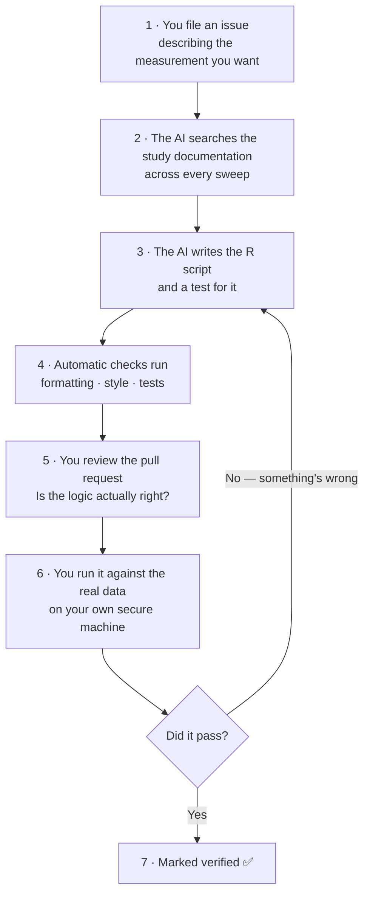
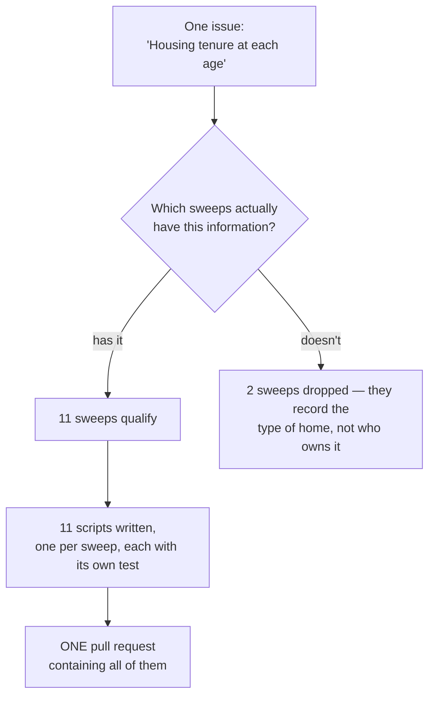
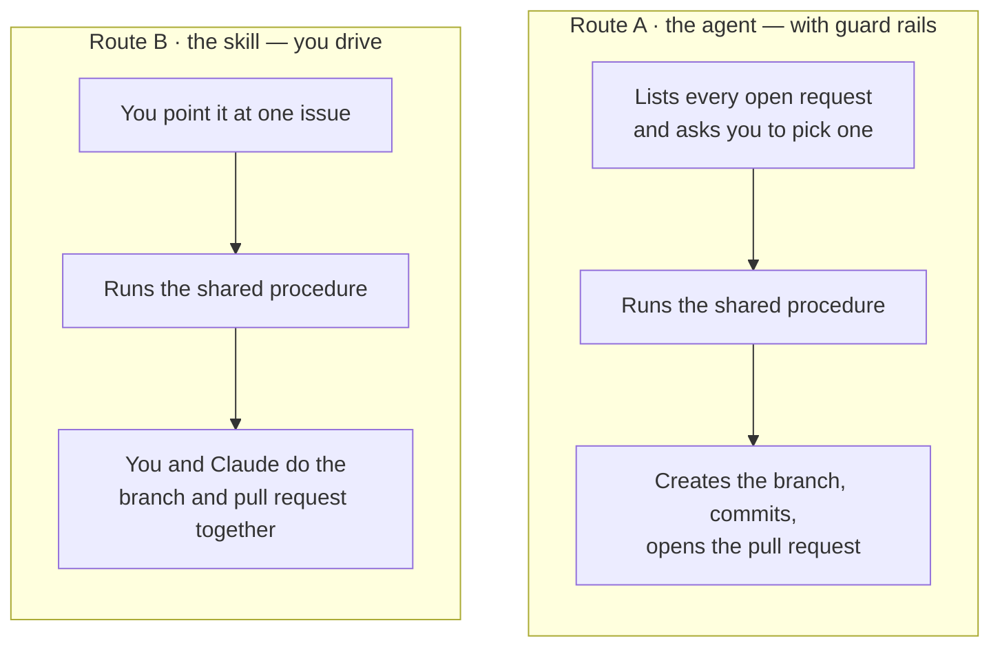
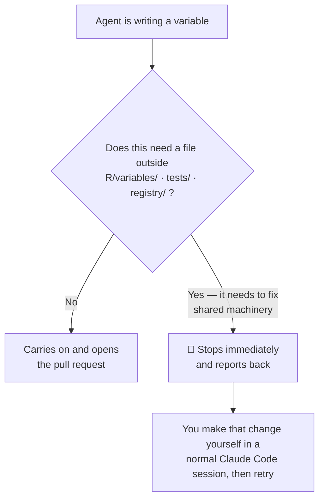
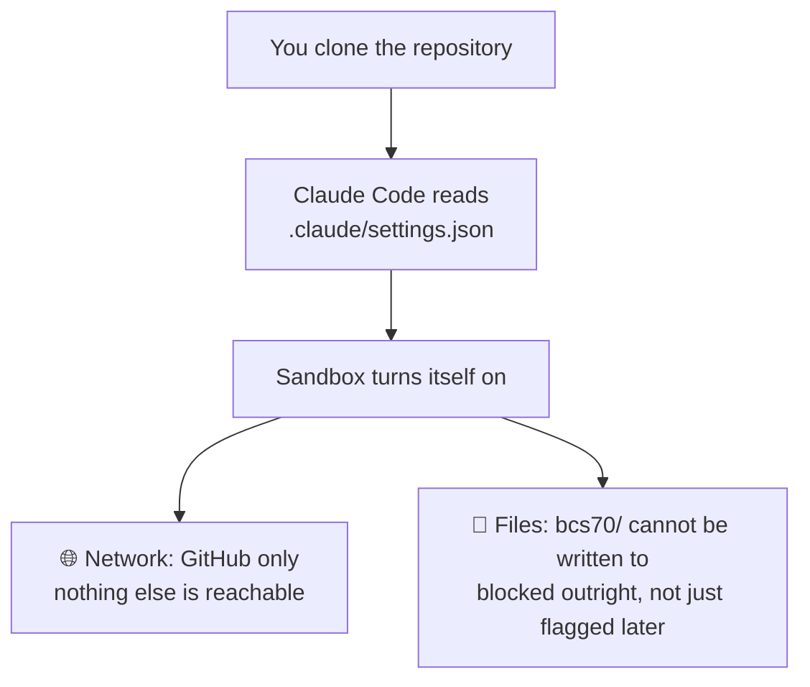

# BCS70 Core Harmonisation

This repository provides **R scripts** that harmonise the multiple sweeps of the [1970 British Cohort Study](https://cls.ucl.ac.uk/cls-studies/1970-british-cohort-study/) into a single tidy dataset, so analysts can get straight to research rather than recoding.

This work is being done with human-in-the-loop AI development. Zero study data is exposed to any LLM. The AI workflow only has access to publicly available metadata and dummy files for each dataset, with absolutely no real data content.

The output is modular R scripts (one per derived variable, under `R/variables/`) that can be run on the actual data via `R/runner.R`. The actual folder and file structure can be recreated by following this repository:

- [CLS-Data/make-directories-bcs70 (shuffle-plus)](https://github.com/CLS-Data/make-directories-bcs70/tree/shuffle-plus)

See [CONTRIBUTING.md](CONTRIBUTING.md) for how to request and add a derived variable.

---

# How the AI workflow works

This section is for anyone who wants to use this repository without needing to know much about coding or AI. It explains what happens, what you type, and what you're responsible for.

## The short version

You describe a variable you want. An AI assistant writes the R script to produce it. **You** check the script, and **you** run it against the real data on a secure machine. Nothing is trusted until a human has confirmed it works.

The AI never sees any real study data. Not once, not partially. It works only from the published documentation — the data dictionaries that describe what each variable *means* — plus empty placeholder files that contain column names and no rows.

## A few words you'll see

| Word | What it means here |
|---|---|
| **Issue** | A request, written on GitHub. "I'd like a variable for housing tenure." |
| **Script** | A file of R code that produces one variable. |
| **Sweep** | One round of the study — the survey at age 5, age 10, and so on. |
| **Family** | The same measurement repeated across several sweeps — e.g. housing tenure at ages 5, 10, 16, 21… One request usually produces a whole family. |
| **Skill** | A written checklist the AI follows. Think of it as a recipe card. |
| **Agent** | A helper that follows a recipe *and* is fenced into a small area of the project. It cannot touch anything else. |
| **Branch** | A private copy of the project where work happens before anyone else sees it. |
| **Pull request (PR)** | A request to merge that private copy into the main project, so people can review it first. |
| **CI** | Automatic checks that run on every pull request. |

## The full journey of a request

One request does **not** mean one variable. Most requests ask for a measurement "at each age", and that produces one script per sweep — see [One request, many sweeps](#one-request-many-sweeps) below. The journey is the same either way.

Steps 2, 3 and 4 are the AI's. **Steps 1, 5, 6 and 7 are yours.** Step 6 is the important one: until a human has run the script against real data, the variable is marked `draft` and is not trusted.

## One request, many sweeps

Most useful measurements exist at several ages, and you'll usually want all of them. So a single request like *"housing tenure at each age"* is not one variable — it's a **family**, with one script per sweep that actually carries the data. They are written together and reviewed together, in **one pull request**.

That's a real example. Issue #8 asked for housing tenure at each age and produced eleven scripts in one pull request; issue #5 asked for BMI and produced nine.

Two things worth knowing about how this is handled:

- **The AI checks which sweeps genuinely have the data** rather than assuming all of them do. For housing tenure, two sweeps were dropped because they only record the *type* of dwelling (house, flat, rooms) and never ask who owns it. Substituting that would have been wrong, so those sweeps simply have no variable.
- **Reviewing them together is deliberate.** Eleven near-identical, sweep-specific scripts side by side make an inconsistency obvious. Split across eleven pull requests, it wouldn't be.

If a request bundles genuinely *different* measurements — say smoking age and cigarettes per day in one issue — that's handled the opposite way. They don't share a derivation or a review, so the AI proposes splitting them into separate issues rather than writing them together.

## Two ways to drive it

Both routes run **exactly the same procedure** to write the variable. They differ only in how much you do by hand.

"The shared procedure" is the same list of steps in both cases: search the documentation across all sweeps → write the script → write a test → format it → check the style → run the test → update the index of variables. There is only one written copy of those steps, so the two routes cannot drift apart.

### Which should you use?

| Situation | Use |
|---|---|
| Ordinary variable request, you want the safety rails | **The agent** |
| You want it to find and list the open requests for you | **The agent** |
| You suspect the job will need changes elsewhere in the project | **The skill** |
| You want to watch and steer each step closely | **The skill** |

## What actually happens when you start the agent

You type, in Claude Code, from the project folder:

> Use the variable-deriver agent

Then:

**1. It starts with a blank memory.** It knows nothing about your previous conversations. It reads its own instruction file and the project's rules, and nothing else. This is deliberate — it makes its behaviour predictable.

**2. It can only use a few tools.** It can read files, search, run commands, and write files. It *cannot* start other agents. This is part of the fencing.

**3. It shows you the open requests and asks which one.** You'll get a list — issue number, title, category, sweeps — and a question. **Answer it.** The agent waits for you.

> ⚠️ Because it asks you a question, don't send it off to run in the background. Keep it in front of you so you can answer.

**4. It does the work.** Searches the documentation, writes the script and its test, formats, checks style, runs the test, updates the index.

**5. It creates a branch and opens a pull request**, then reports back.

**6. You only see its final summary.** You don't watch it work step by step. Its closing report is the whole picture you get, so read it properly — it will tell you what it made, what it checked, and anything it got stuck on.

## When the agent stops and hands back

This is normal, and it's the system working correctly.

The agent is only allowed to add variable scripts, their tests, and the index. If producing a variable turns out to need a change to the project's shared machinery, it must stop rather than make it.

That has genuinely happened twice:

- adding the `sex` variable uncovered two bugs in shared code
- the housing tenure variables uncovered duplicate identifiers in two of the study's files, which needed the shared data-loading code changed

Both times, stopping was the right answer. A human made the fix, and the variable work continued afterwards.

**If you already expect that to happen, use the skill instead of the agent** — a normal Claude Code session can make those fixes; the agent cannot.

## Things the AI is never allowed to do

- **See real data.** Every data file in this repository is an empty placeholder with column headings only.
- **Change the data folder.** `bcs70/` is read-only. An automatic check rejects any pull request that touches it.
- **Mark a variable as verified.** Only a human can, after running it against real data.
- **Edit the data knowledge ledger** ([`DATA_KNOWLEDGE.md`](DATA_KNOWLEDGE.md)) — the record of known quirks in the study files. The AI reads it, and reports things that ought to be added, but people write the entries, because establishing them needs real data.

> 🔒 **The one rule that matters most:** never run any of this in a folder that contains real study data. Use a normal checkout of this repository, which contains only placeholders.

## Running it in a sandbox

You don't have to take the list above on trust. This repository ships a **sandbox configuration**, so if you clone it and run Claude Code, the AI is confined automatically — there's no switch to remember to flip.

Two things are worth understanding about this:

- **It confines, it doesn't merely warn.** The `bcs70/` data folder is meant to be read-only. Until now that was enforced by review and by an automatic check that catches a bad write *after* it happened. Inside the sandbox the write simply fails.
- **Setup happens first, outside the sandbox.** Installing the R packages needs CRAN, and signing in to GitHub needs a browser — neither of which the sandbox permits. Both are one-time steps the AI never repeats.

Full instructions, including what the settings do and two honest limitations, are in [CONTRIBUTING.md § Setup](CONTRIBUTING.md#setup-running-the-agent-in-sandbox-mode).

## Where to go next

- [CONTRIBUTING.md](CONTRIBUTING.md) — the full workflow in detail, and how to request a variable
- [DATA_KNOWLEDGE.md](DATA_KNOWLEDGE.md) — known quirks and traps in the study files
- [R/variables/README.md](R/variables/README.md) — how variable scripts are organised
