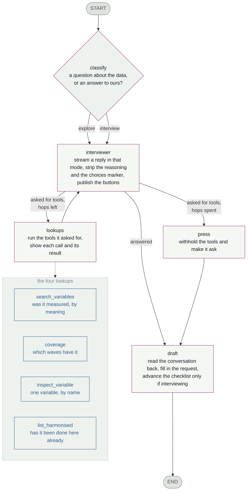

# The assistant

A LangGraph that answers questions about the study and interviews a researcher
until a variable request is complete enough to implement, searching the data
dictionaries on its own initiative as it goes.

`../chat.js` and `../chat/` only draw this. Nothing about *what it asks* lives
in the browser, and nothing dataset-specific lives in this directory — the
study, its waves, its categories, the assistant's capabilities and the whole
interview come from `../dataset.toml`.

## The graph



One message runs the graph once. The loop between `interviewer` and `lookups`
is the model deciding what it needs to know; `press` is the escape hatch when
it never stops deciding.

| node | |
|---|---|
| **classify** | Which intent is this message? See *the router*. |
| **interviewer** | Streams one reply in that intent's terms. Separates the model's reasoning from its answer, pulls out the answer buttons it marked, publishes both. |
| **lookups** | Runs the tools it asked for, publishes each call *with its arguments* and its result, and records what was found. |
| **press** | Reached only when the hop budget is gone. Re-asks with the tools withheld, because a model mid-search returns nothing rather than change course. If it still says nothing, `_carry_on` takes over. |
| **draft** | Reads the conversation back and fills in the request. Runs after the answer, never before. Advances the checklist only when the intent says to. |

## Intents

What the assistant can be asked for. Each is an `[[intent]]` in
`dataset.toml`: a description the router matches on, the instructions the
assistant then works to, and whether answering it moves the checklist.

| | **interview** | **explore** |
|---|---|---|
| the message is | an answer, a request, a correction | a question about the data |
| it does | drives the next unsettled step | answers, and stops |
| checklist | the answered step is credited | never advances |
| the draft | fills in | fills in |

The draft fills in either way; only the checklist is held back. Someone saying
"I only care about the adult sweeps" while asking a question has told us
something worth keeping — but they were not answering a question, so nothing is
ticked. Facts captured, progress not claimed.

**Adding a capability is a config change.** Add an `[[intent]]`; the router
offers it and the assistant works to its instructions. Everything an intent
changes about a turn is declared, never inferred from its name:

| | |
|---|---|
| `advances` | answering it credits a checklist step |
| `shows_checklist` | the prompt carries what is settled and what is open |
| `offers_choices` | the reply may end with answer buttons |

The last two default to whatever `advances` says. They exist because they were
once decided by comparing the id against `"interview"` in `prompts.py` and
`"explore"` in the browser, so a third intent got whatever those comparisons
happened to give it.

## The router

`classify` asks the helper model, giving it each intent's description and the
question just asked. About a second, and it reads intent rather than syntax:

| message | rule | model | |
|---|---|---|---|
| `Remind me what b7khlstt is` | interview | **explore** | rule wrong |
| `I forget whether height was measured at 10y` | interview | **explore** | rule wrong |
| `Tell me more about that variable` | explore | explore | |

No punctuation rule catches the first two, and no word list will catch the next
intent someone adds. A heuristic stays behind it, chosen by
`[assistant] router`: **`model`**, **`heuristic`**, or **`auto`** (the default
— the model, with the rule as fallback, because a routing failure should
degrade a turn rather than end it). The opening message skips the router: it is
the request however it is phrased.

## The tools

| | |
|---|---|
| `search_variables` | **By meaning.** Whether a concept was measured, what it was called, at which waves. Optionally scoped to one wave. |
| `coverage` | **By wave.** One concept reported across every wave, including the ones with nothing. See below — `search_variables` cannot answer this. |
| `inspect_variable` | **By name.** One variable's full entry — declared missing values and every value label. What the sentinels *actually* mean. On a miss it offers similar names but never picks one. |
| `list_harmonised` | Whether **this repository** has already done it. A small registry — not the study's own `(Derived)` variables, which `search_variables` finds. Conflating the two once answered "which sweeps have a derived self-rated health variable?" with "no precedent". |

Every call appears in the transcript with its arguments, and every variable
name it surfaces links through to that variable in the atlas.

**The split between the first two is the whole design.** One tool guessing at
both intents is what produced the worst ranking bug this has had: a bonus for
query words that happen to be variable names, which put `day` ("DAY NUMBER")
above every cigarette variable for *"cigarettes per day"*. The bonus was also
unnecessary — a name is indexed whole, so it is a term in exactly one document
and BM25 ranks it first unaided. It is gone; the model declares which kind of
lookup it wants by choosing a tool.

**`coverage` exists because ranking and coverage are different questions.**
`search_variables` scores every wave against every other and returns the best
ten groups overall, so a wave whose variable ranks lower is missing from the
answer rather than absent from the study — for *"general health"* the 29y and
38y variables sit at rank 72 and 76 of a 150-document pool. `coverage` scores
the same single pass and buckets by wave instead of truncating, reporting all
fourteen including the empty ones. 0.4 ms, no extra model call.

It answers in **three** states, not two. A wave is *measured* when a label
accounts for enough of the query's idf mass, *possible* when it accounts for
some, and *nothing* otherwise. The middle state is the point rather than a
hedge: `hlthgen` ("How is your health generally") does not match the term
`general` at all — "generally" does not stem to it — so a strict floor would
drop the very wave the tool was built to surface. Its own result text says so
in as many words, because a model told only "unconfirmed at 29y" folds that in
with the waves that have nothing and reports a real variable as absent. That
happened, and the wording is the fix.

## Words, meaning, and other wordings

BM25 matches words. The dictionaries are transcribed questionnaires, so they
say *"How is your health generally"* where a researcher says *"self-rated
health"* — the two vocabularies share no content word, and no lexical tuning
joins them. Two things now sit over BM25, both optional, both configurable in
`dataset.toml` and adjustable per conversation in the drawer.

**Semantic search** (`vectors.py`) embeds every label once, offline, and scans
the lot per query. **Query expansion** (`expansion.py`) asks the helper model
to rephrase the search the way a questionnaire would and retrieves each
wording. Results are combined by **reciprocal rank fusion** — a document
scores `1/(k + rank)` in each list it appears in, summed. Scores are never
added directly: a BM25 score and a cosine are not on one scale, and
normalising them invents a relationship that changes with every query. RRF
reads only position, so a variable two methods agree on beats one that a
single method liked loudly.

Measured on this corpus, finding the eight variables that record self-rated
health:

| | found | cost |
|---|---|---|
| lexical only | **2 of 8** | ~1 ms |
| + semantic | **6 of 8** | ~325 ms |
| + expansion | **7 of 8** | ~2 s |

**The index is optional and not in the repository.** Built locally by
`python3 web/build_embeddings.py` in about four minutes, into the gitignored
`web/data/`. CI has neither Ollama nor the file, so everything degrades to
lexical search and says so — in the server's first line, in `/api/health`, and
as a disabled switch carrying the reason.

**No numpy, and none wanted.** The vectors live in an `array('f')`; a dot
product over a slice of one is C-backed, so a full scan of 32,454 variables
costs ~150 ms at 256 dimensions. Truncating `nomic-embed-text` to 256 still
agrees with the full vector on 95% of the top ten at 2.8× the speed — safe
only because that model is trained for it.

**Vectors are positional, so a stale index is refused rather than used.** Row
8,000 of the file is row 8,000 of `variables.json`. Insert one variable and
every vector after it describes something else, with plausible scores, real
names, and nothing that looks wrong — so the index carries a fingerprint of
the names it was built from. Refusing to search is recoverable; silently
searching the wrong corpus is not.

**Meaning surfaces candidates; it never confirms one.** A semantically found
variable has a poor lexical share by definition, so it skips `coverage`'s
floor — but it can never count as *measured*, because those thresholds are idf
mass and mean nothing against a cosine. That is what the middle tier is for.

`inspect_variable` **never resolves a name it was not given.** On a miss it
suggests names differing only in their digits — `b8hlthgn` → `b9hlthgn` — and
leaves the choice to the model. Edit distance is the obvious thing and the
wrong one: 93% of this study's 31,947 names have another *real* variable one
edit away, and one edit from `b960434` covers height in feet, metres and
centimetres. A fuzzy match returns a plausible, wrong, unfalsifiable answer.

## The state

```
messages     the conversation, as LangChain messages
pinned       variables dragged in — raw ones are SOURCES, derived ones PRECEDENT
covered      {step_id: True} — ratchets forward; only a revision moves it back
draft        the request being assembled
options      the answer buttons for the reply just given
asked_step   which step the question was about
separate     concepts that should be split into their own issues
hops         tool round-trips used this turn
mode         which intent the router chose
seen         every variable the lookups surfaced, as records
```

`seen` is a reduced field: each lookup adds to one working set rather than
replacing it. It exists because the alternative was re-parsing the *rendered
text* of every tool result on every turn — splitting on pipes, stripping
punctuation, hoping — which kept only the name and broke whenever the wording
changed.

No checkpointer is configured and none is wanted: the browser holds the
conversation and posts it back each turn, so a server restart is invisible and
nothing accumulates per user. The graph's state exists for exactly one turn.

## The event stream

Nodes publish through `get_stream_writer()` in the shape `../chat.js` already
reads, so `stream_mode="custom"` is the only mode used.

| event | |
|---|---|
| `mode` | which intent, its label, and whether it advances the checklist |
| `thinking` | the model's working — buffered and sent **once**, shown collapsed |
| `content` | prose, streamed |
| `tool_call` / `tool_result` | what it looked up, with arguments, and what came back |
| `options` | the answer buttons, and the step the question was about |
| `draft` | the assembled request, plus checklist progress |
| `error` / `done` | |

## The files

```
standard library — these work with nothing installed
  router.py      which intent is this message? model, with a rule behind it
  prompts.py     the system prompt, schemas, extraction instructions
  choices.py     TagSpan: pulls tagged spans out of a live stream
  retrieval.py   BM25, coverage, rank fusion, and the per-turn settings
  vectors.py     the semantic index: load it, scan it, refuse a stale one
  expansion.py   other wordings of the same search, from the helper model
  corpus.py      the metadata build_site.py emits, and its shape
  transcript.py  the conversation the browser posts back, planned into
                 messages: ids minted, results paired, orphans dropped
  tools.py       the four lookups: schemas, and executors
  ollama.py      listing models, embedding, and one-shot completions

needs `uv sync --extra assistant`
  graph.py       the diagram above
  llm.py         ChatOllama for the interviewer and the helper
  agent.py       drives one turn, translates it for the browser
```

The split is deliberate: the atlas, the metadata search and the model picker
depend on the top half and must keep working in a checkout that installed
nothing. Importing this package does not pull in LangGraph; `assistant.load()`
does, and names the fix when it cannot.

It also decides what can be tested: CI installs nothing, so a test importing
`graph.py` or `agent.py` cannot run there. Rules worth guarding therefore live
outside them — the hop budget in `Config.hops_spent`, the message pairing in
`transcript.plan`. Both were wrong once, invisibly. What is left in the bottom
half is a graph, two model builders and a mapping.

## Eight things that are not what you would write first

Each was a bug before it was a decision.

**Tokens are written by hand, not streamed by LangGraph.** `messages` stream
mode emits raw model tokens, and those include the marker the model uses to
declare its answer buttons — which must never reach the transcript and arrives
split across chunks.

**Tools are executed in the node, not by `ToolNode`.** Each lookup produces two
things: a terse string for the model and a richer structure for the transcript
card. A tool's return value has room for one.

**The choices come from the model, inline.** It ends the message with
`<choices>…</choices>`, parsed off the stream: ~200 ms to buttons, against
3.5–8.6 s when a second model reverse-engineered them from the prose. The span
**closes at the closing tag** and normal output resumes — swallowing to the end
of the stream once discarded twenty-one seconds of a reply — and text either
side of it gets its paragraph break back.

**Reasoning is stripped from the answer as well as read from the API field.**
Some models emit `<think>` inline; one, told *not* to reason, reasons anyway
and dumps it into the reply trailing a stray `</think>`. That is what lets
`llm.py` keep sending `reasoning=False`, a real saving where honoured. The two
only work together.

**The hop budget is announced, not just enforced.** Stated in the prompt and
counted down in the tool results from two remaining. Warning only on the last
hop comes too late — the turn is already spent.

**A silent model does not end the turn.** `_carry_on` asks the next open
step's own probe, with that step's answers as buttons; with everything settled
it says the request is complete and points at the Draft panel. It used to
leave a shrug in the transcript, handing back a conversation the researcher
came here to be led through.

**A correction may reopen a step.** The checklist ratchets forward so a model
forgetting turn two on turn six cannot un-tick it; a researcher changing their
mind is the opposite case, and the extractor reports `revised`.

**The `options` event names the step its question was about** — crediting
whichever step happened to be *next* meant answering one question ticked
another off. It names none when the intent does not advance, and none when
every step is settled, since there is then no question: `first_unsettled`
returns the last step as a fallback, and reading that as an answer offered the
last step's stock replies under "the request is complete".

## When something goes wrong

The transcript gets a sentence; the browser console gets the stack. A
client-side fault is otherwise indistinguishable from a model or network one —
*"Cannot read properties of undefined"* once meant `/api/interview` had
answered without its `steps`, nothing to do with the model. That payload is
checked at boot now, so the same cause disables the drawer with the actual fix
in its tooltip; the usual reason is an older `server.py` holding the port.

## Changing things

| to change | edit |
|---|---|
| how the dictionaries are searched | `../dataset.toml` → `[retrieval]`, or the drawer's settings for one conversation |
| the embedding model, or its dimensions | `../dataset.toml` → `[retrieval] embed_model`, `embed_dims`, then rebuild the index |
| what it knows about the study | `../dataset.toml` → `[dataset] about`, `cautions` |
| what it asks, or the answers it offers | `../dataset.toml` → `[[interview.step]]` |
| what it can be asked to do | `../dataset.toml` → `[[intent]]` |
| how it is told to behave | `prompts.py` |
| what it can look up | `tools.py`, and the diagram above |
| the shape of the conversation | `graph.py` |
| how any of it looks | `../chat/` |
