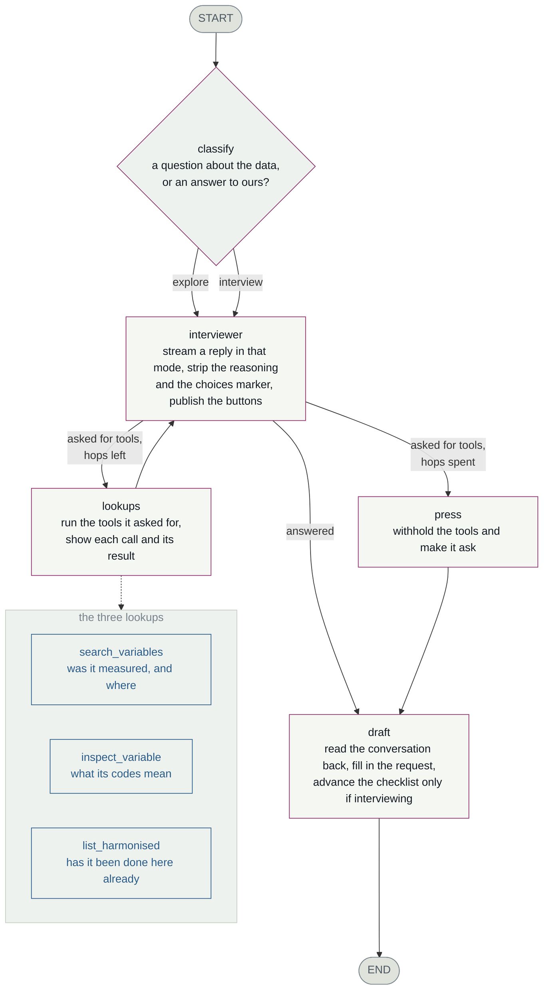

# The assistant

A LangGraph that answers questions about the study and interviews a researcher
until a variable request is complete enough to implement, searching the data
dictionaries on its own initiative as it goes.

`../chat.js` and `../chat/` only draw this. Nothing about *what it asks* lives
in the browser, and nothing dataset-specific lives in this directory — the
study, its waves, its categories, the assistant's capabilities and the whole
interview come from `../dataset.toml`.

## The graph



One message runs the graph once. The loop between `interviewer` and `lookups`
is the model deciding what it needs to know; `press` is the escape hatch when
it never stops deciding.

| node | |
|---|---|
| **classify** | Which intent is this message? See *the router*. |
| **interviewer** | Streams one reply in that intent's terms. Separates the model's reasoning from its answer, pulls out the answer buttons it marked, publishes both. |
| **lookups** | Runs the tools it asked for, publishes each call *with its arguments* and its result, and records what was found. |
| **press** | Reached only when the hop budget is gone. Re-asks with the tools withheld, because a model mid-search returns nothing rather than change course. If it still says nothing, `_carry_on` takes over. |
| **draft** | Reads the conversation back and fills in the request. Runs after the answer, never before. Advances the checklist only when the intent says to. |

## Intents

What the assistant can be asked for. Each is an `[[intent]]` in
`dataset.toml`: a description the router matches on, the instructions the
assistant then works to, and whether answering it moves the checklist.

| | **interview** | **explore** |
|---|---|---|
| the message is | an answer, a request, a correction | a question about the data |
| it does | drives the next unsettled step | answers, and stops |
| checklist | the answered step is credited | never advances |
| the draft | fills in | fills in |

The draft fills in either way; only the checklist is held back. Someone saying
"I only care about the adult sweeps" while asking a question has told us
something worth keeping — but they were not answering a question, so nothing is
ticked. Facts captured, progress not claimed.

**Adding a capability is a config change.** Add an `[[intent]]`; the router
offers it and the assistant works to its instructions. No branch in
`router.py`, none in `prompts.py`, none in `graph.py` — which asks
`intent.advances` rather than comparing against a name.

## The router

`classify` asks the helper model, giving it each intent's description and the
question just asked. About a second, and it reads intent rather than syntax:

| message | rule | model | |
|---|---|---|---|
| `Remind me what b7khlstt is` | interview | **explore** | rule wrong |
| `I forget whether height was measured at 10y` | interview | **explore** | rule wrong |
| `Tell me more about that variable` | explore | explore | |

No punctuation rule catches the first two, and no word list will catch the next
intent someone adds. A heuristic stays behind it, chosen by
`[assistant] router`: **`model`**, **`heuristic`**, or **`auto`** (the default
— the model, with the rule as fallback, because a routing failure should
degrade a turn rather than end it). The opening message skips the router: it is
the request however it is phrased.

## The tools

| | |
|---|---|
| `search_variables` | Whether a concept was measured, what it was called, at which waves. Optionally scoped to one wave. |
| `inspect_variable` | One variable's full entry — declared missing values and every value label. What the sentinels *actually* mean. |
| `list_harmonised` | Whether **this repository** has already done it. A small registry — not the study's own `(Derived)` variables, which `search_variables` finds. Conflating the two once answered "which sweeps have a derived self-rated health variable?" with "no precedent". |

Every call appears in the transcript with its arguments, and every variable
name it surfaces links through to that variable in the atlas.

## The state

```
messages     the conversation, as LangChain messages
pinned       variables dragged in — raw ones are SOURCES, derived ones PRECEDENT
covered      {step_id: True} — ratchets forward; only a revision moves it back
draft        the request being assembled
options      the answer buttons for the reply just given
asked_step   which step the question was about
separate     concepts that should be split into their own issues
hops         tool round-trips used this turn
mode         which intent the router chose
seen         every variable the lookups surfaced, as records
```

`seen` is a reduced field: each lookup adds to one working set rather than
replacing it. It exists because the alternative was re-parsing the *rendered
text* of every tool result on every turn — splitting on pipes, stripping
punctuation, hoping — which kept only the name and broke whenever the wording
changed.

No checkpointer is configured and none is wanted: the browser holds the
conversation and posts it back each turn, so a server restart is invisible and
nothing accumulates per user. The graph's state exists for exactly one turn.

## The event stream

Nodes publish through `get_stream_writer()` in the shape `../chat.js` already
reads, so `stream_mode="custom"` is the only mode used.

| event | |
|---|---|
| `mode` | which intent; the transcript marks an exploration |
| `thinking` | the model's working — buffered and sent **once**, shown collapsed |
| `content` | prose, streamed |
| `tool_call` / `tool_result` | what it looked up, with arguments, and what came back |
| `options` | the answer buttons, and the step the question was about |
| `draft` | the assembled request, plus checklist progress |
| `error` / `done` | |

## The files

```
standard library — these work with nothing installed
  router.py      which intent is this message? model, with a rule behind it
  prompts.py     the system prompt, schemas, extraction instructions
  choices.py     TagSpan: pulls tagged spans out of a live stream
  retrieval.py   BM25 over the variable descriptions
  corpus.py      the metadata build_site.py emits, and its shape
  tools.py       the three lookups: schemas, and executors
  ollama.py      listing models for the picker

needs `uv sync --extra assistant`
  graph.py       the diagram above
  llm.py         ChatOllama for the interviewer and the helper
  agent.py       drives one turn, translates it for the browser
```

The split is deliberate: the atlas, the metadata search and the model picker
depend on the top half and must keep working in a checkout that installed
nothing. Importing this package does not pull in LangGraph; `assistant.load()`
does, and names the fix when it cannot.

## Seven things that are not what you would write first

Each was a bug before it was a decision.

**Tokens are written by hand, not streamed by LangGraph.** `messages` stream
mode emits raw model tokens, and those include the marker the model uses to
declare its answer buttons — which must never reach the transcript and arrives
split across chunks.

**Tools are executed in the node, not by `ToolNode`.** Each lookup produces two
things: a terse string for the model and a richer structure for the transcript
card. A tool's return value has room for one.

**The choices come from the model, inline.** It ends the message with
`<choices>…</choices>`, parsed off the stream — about 200 ms to buttons, against
3.5–8.6 s when a second model reverse-engineered them from the prose. The span
**closes at the closing tag** and normal output resumes; swallowing to the end
of the stream once discarded twenty-one seconds of a reply. Text either side of
the removed span gets its paragraph break back, or a question mark runs into
the next capital.

**Reasoning is stripped from the answer as well as read from the API field.**
Some models emit `<think>` inline, and one — told *not* to reason — reasons
anyway, stops using the field, and dumps it into the reply trailing a stray
`</think>`. `llm.py` may therefore keep sending `reasoning=False`, which is a
real saving where honoured. The two changes only work together.

**The hop budget is announced, not just enforced.** Stated in the prompt and
counted down in the tool results from two remaining. Warning only on the last
hop comes too late — the turn is already spent.

**A silent model does not end the turn.** `_carry_on` asks the next open step's
own probe, with that step's answers as buttons; with every step settled it says
the request is complete and points at the Draft panel. It used to leave a shrug
in the transcript, which hands back a conversation the researcher came here to
be led through.

**A correction may reopen a step.** The checklist ratchets forward so a model
forgetting turn two on turn six cannot un-tick it. A researcher changing their
mind is the opposite case: the extractor reports `revised`, and those steps go
back to unsettled. The `options` event names the step its question was about,
because crediting whichever step happened to be *next* meant answering one
question ticked another off.

## When something goes wrong

The transcript gets a sentence; the browser console gets the stack. A
client-side fault is otherwise indistinguishable from a model or network
failure — one showed up as *"Something went wrong. Cannot read properties of
undefined (reading 'map')"*, which had nothing to do with the model:
`/api/interview` had answered without its `steps`. That payload is now checked
once at boot, so the same cause disables the drawer with the actual fix in its
tooltip. The usual reason is an older `server.py` still holding the port.

## Changing things

| to change | edit |
|---|---|
| what it knows about the study | `../dataset.toml` → `[dataset] about`, `cautions` |
| what it asks, or the answers it offers | `../dataset.toml` → `[[interview.step]]` |
| what it can be asked to do | `../dataset.toml` → `[[intent]]` |
| how it is told to behave | `prompts.py` |
| what it can look up | `tools.py`, and the diagram above |
| the shape of the conversation | `graph.py` |
| how any of it looks | `../chat/` |
